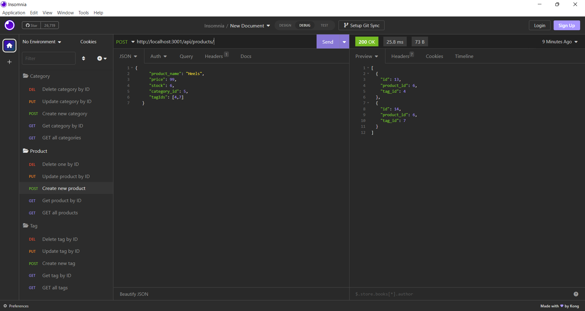

# E-Commerce Backend code
  
  ## Description
  This backend code is built from a starter code to connect the database and API routes for an e-commerce site. The application is a tool that allows users to easily build thier e-commerce website, providing functions to sort products into different categories, and attach various tags to the product.The database contains Category, Product and Tag information where users can view, create, update or delete their product from the database.
  Below is a screenshot of the response to API requests in Insomnia:
  
  ## Table of Contents
  - [Description](#description)
  - [Usage](#usage)
  - [Installation](#installation)
  - [Contributing](#contributing)
  - [Questions](#questions)
  ## Usage
  You can view the response of each API request by testing the routes in Insomnia. Using GET request to retrieve data information of each table. To retrieve a specific item, enter the id number in the url to selectively view one item. Use the POST request for creating new item. Simply enter the values of the new item and send the url and the new item will be added to the database. You can update the values of your item via PUT request, and delete the item with DEL request quoting their id number in the url. Here is a walkthrough video to demonstrate the usage of this application: [Link to walkthrough video](https://drive.google.com/file/d/1B7aOyodbm2odQZAQqkyhPpZ86_DA02HH/view)
  ## Installation
  The E-Commerce Backend code requires MySQL2, Sequelize and Express packages to connect the MySQL database to API calls. The dotenv package is required to use environment variables to store sensitive data such as MySQL username, password and database name. 
  You will need to install the packages by entering "npm i" in visual studio command line. Once installed, create the schema from the MySQL shell with the command "mysql -u root -p" followed by your password, then "source schema.sql". Run "npm run seed" to seed the data to your database. Then you are ready to start the application server by running "npm start". The various API request routes can then be tested in Insomnia.
  
  ## Contributing
  If you would like to contribute to this project, head to my GitHub page to see details of the application code. You can also contact me via my email below for any suggestions and feedback.
  ## Questions
  Check out my projects on my GitHub account at https://github.com/Sandy5433
  . If you have any questions about the application, you can reach me via my email at sandyhung83@yahoo.com.tw 
  